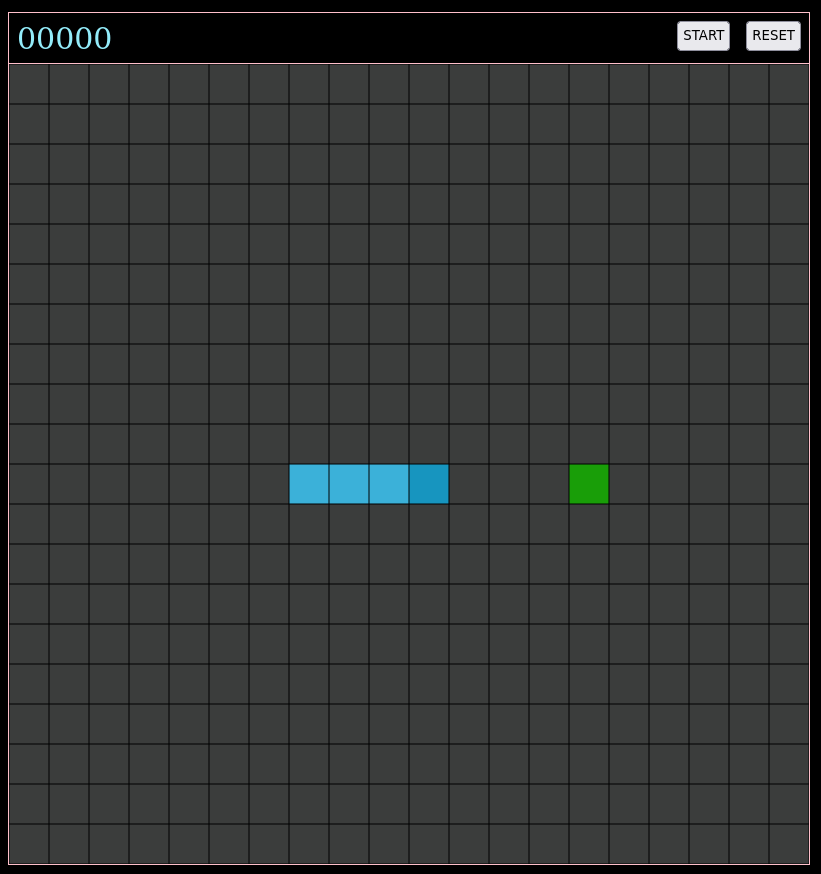

# Snake

## Reasoning for project
This is my version of Snake in TypeScript. I have never used TypeScript before and really wanted to learn it as it seems to combine what I enjoy about strongly typed languages with the capability of JavaScript.

This project was originally going to be Tetris, but when I looked more into the rules of piece flipping I decided the goal is not to create Tetris, but instead learn TypeScript. Based on that reasoning I decided to move over to Snake as it is a lot simpler to make.

## References
The actual logic behind the game was all done by myself (which is why some of it may not be the most ideal). I used [this project](https://github.com/bytegames/bytes) as a base for part of my CSS and HTML layout.

## How to run
To run make sure that you have `npm`, `typescript` and `serve`. Then run `npm run start` and it will locally host at `localhost:5000`.